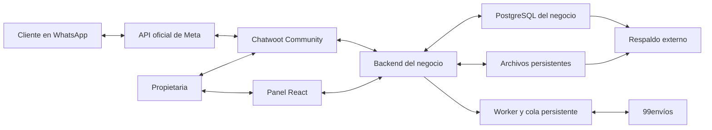

# Roadmap de automatización de ventas de calzado por WhatsApp

Fecha de preparación: 4 de septiembre de 2026.

Estado: implementación local en curso. Actualizado el 9 de septiembre de 2026.

## Actualización operativa: experiencia premium y reglas de envío

El bloque principal de preferencias de envío ya está implementado en la rama `codex/premium-ux`:

- panel responsive con navegación operativa e Inicio;
- política global de envío y reemplazo exacto por código DANE;
- transportadora automática, preferida u obligatoria;
- fallback permitido o bloqueado con error visible;
- modalidades “económico y protegido”, “solo económico” y “siempre protegido”;
- Seguro 99 estándar o Plus enviado realmente al cotizador y al crear la guía;
- dos cotizaciones independientes cuando el cliente debe elegir;
- elección numerada en WhatsApp antes de crear el resumen;
- snapshot de la política y seguro confirmado en la cotización y la tarea de guía;
- registro de transportadoras observadas y auditoría persistente de cambios;
- simulador de regla efectiva sin crear cotizaciones ni guías;
- contratos estrictos, migraciones incrementales y pruebas unitarias, de integración y E2E.

Los siguientes bloques del plan premium permanecen separados: centro de alertas, cierre diario para Treinta, página completa de salud de integraciones y ampliación visual de pedidos/conversaciones. La autoridad de stock para WhatsApp continúa siendo Camila y Treinta se conciliará manualmente mediante archivo.

## 1 Objetivo y alcance acordado

Construir en la carpeta `camila` una solución de venta guiada por WhatsApp: talla → fotografías de modelos disponibles → modelo y color → datos de entrega → cotización → confirmación → reserva → guía contraentrega y PDF de 99envíos.

La operación actual recibe más de 100 conversaciones diarias y aproximadamente 250 ventas mensuales. Todas las ventas se realizan por WhatsApp y son contraentrega. El presupuesto y la fecha contractual se acordarán por separado.

Decisiones de esta versión:

- Un negocio y un número de WhatsApp; interfaz y mensajes en español.
- Flujo programado sin IA generativa. Texto libre limitado a referencias, talla y datos personales; las consultas no contempladas pasan a una persona.
- Fotografías reales como adjuntos visibles en el chat.
- Referencias comerciales permanentes para modelos y SKU para variantes.
- Catálogo inicial de 10 modelos; carga posterior desde el panel.
- Inventario operativo central y conciliación manual diaria con Treinta.
- Chatwoot Community como bandeja de atención humana.
- Aplicación, base de datos, archivos y Chatwoot en un VPS; copias fuera del VPS.
- API oficial de WhatsApp. Meta y 99envíos siguen siendo servicios externos.
- La propietaria puede pausar el bot, responder y devolverle el control.

No incluye en esta versión: conexión automática con Treinta, campañas masivas, otros canales, comprensión abierta con IA, audios, reconocimiento de zapatos en fotos del cliente, contabilidad, conciliación financiera del recaudo, seguimiento logístico completo, cancelación automática de guías ni aplicación móvil propia.

## 2 Estado real del proyecto

La carpeta contiene una propuesta en `entregables/`, materiales de investigación en `proposal_work/` y un repositorio Git. No se encontró una aplicación existente que reutilizar; estos materiales se conservarán y no son módulos del producto.

Ya existe una aplicación local versionada. El núcleo actual incluye un monorepo TypeScript, API Fastify, panel React, PostgreSQL, migraciones Drizzle, almacenamiento local de fotografías y pruebas automatizadas. El panel está protegido para una sola propietaria mediante usuario, contraseña hasheada y sesión segura.

El catálogo permite crear, editar, activar o desactivar referencias, asociar una fotografía real por referencia y ajustar existencias por talla. Las tallas aceptan enteros y medias tallas para crecimiento futuro. La consulta de disponibilidad por talla excluye referencias inactivas, sin foto o sin unidades disponibles; devuelve referencias paginadas sin repetir. Los movimientos de inventario se registran y las escrituras concurrentes de stock están serializadas.

Los commits que sustentan este estado son: `4d497e6` (base local), `b715aff` y `be7a55c` (catálogo, inventario y concurrencia), `725e560` (administración protegida), `d536db0` y `bbc86cc` (contratos, panel y entorno E2E), y `e325c7e` (entorno de integración reproducible). La verificación actual reúne 46 pruebas de contratos, 64 unitarias de API, 29 unitarias del panel, 57 de integración y 7 E2E.

Ya existen pedidos, resúmenes versionados, reservas concurrentes y su ciclo manual, además de un flujo guiado local conectado al webhook oficial de Meta. El bot recibe talla, envía solo las fotos disponibles para esa talla, recopila datos, confirma una única reserva y deja una tarea persistente de guía. La propietaria puede ver conversaciones y tomar o devolver el control, cancelando las respuestas pendientes del bot.

La integración de 99envíos está aislada en un cliente de servidor y una cola persistente: autentica, cotiza, crea el preenvío contraentrega, clasifica resultados creados, fallidos o inciertos, descarga el PDF y expone la operación en el panel. La prueba real completó cotización, guía TCC contraentrega y PDF. La auditoría corrigió el total enviado a la guía, identificadores numéricos no documentados y respuestas de PDF mediante URL. El recorrido completo también está cubierto con PostgreSQL real y un proveedor controlado. Chatwoot, Redis, despliegue VPS, copias externas y sincronización con Treinta aún no se han incorporado.

La propuesta comercial enviada describía atención más amplia. Antes del piloto se explicará a la propietaria que esta versión utiliza opciones guiadas y deriva a una persona lo que no puede resolver.

## 3 Arquitectura propuesta



### Tecnologías

| Componente | Elección | Responsabilidad |
|---|---|---|
| Lenguaje | TypeScript sobre Node.js LTS | Backend, worker y panel |
| API | Fastify | Webhooks, autorización, pedidos y operaciones |
| Panel | React y Vite | Catálogo, inventario, pedidos y configuración |
| Datos | PostgreSQL | Transacciones, inventario, reservas y auditoría |
| Cola | pg-boss | Trabajos del negocio persistidos en PostgreSQL |
| Bandeja | Chatwoot Community | Conversaciones y atención humana |
| Dependencias de Chatwoot | PostgreSQL y Redis | Bases y usuarios separados de los del negocio |
| Despliegue | Docker Compose | Servicios y volúmenes reproducibles |
| HTTPS | Caddy | Certificados y proxy inverso |
| Fotos y PDF | Volumen persistente | Archivos del negocio y entrega autorizada |
| Respaldo | Copia cifrada externa | Recuperación de datos, archivos y configuración |

La versión exacta de cada dependencia se fijará al iniciar la implementación, comprobando compatibilidad y soporte vigentes. Se versionarán los lockfiles y se fijarán las imágenes de producción; no se desplegará automáticamente una etiqueta `latest`.

Chatwoot será el punto de entrada y salida de las conversaciones. El backend responderá por su API para conservar el historial en la bandeja. La prueba de integración comprobará fotos, opciones y contexto del anuncio. Si un formato interactivo no se preserva correctamente, se utilizarán opciones numeradas; no se enviará por una segunda ruta que deje mensajes invisibles para la asesora.

### Organización prevista

```text
camila/
  ROADMAP.md
  docs/
    decisions/                 decisiones de arquitectura
    integrations/             contratos y resultados de pruebas
    operations/               instalación, copias y recuperación
    acceptance/               evidencia del piloto
    superpowers/plans/        planes de implementación por fase
  apps/
    api/src/modules/
      auth/                   acceso de propietaria y operador
      catalog/                productos, variantes, fotos y localidades
      inventory/              movimientos, reservas y conciliación
      conversations/          máquina de estados y menús
      orders/                 confirmación y ciclo de pedido
      shipping/               integración y estados de guía
      chatwoot/               adaptador y webhooks
      media/                  archivos y controles de acceso
    worker/src/               consumidores de trabajos persistentes
    admin/src/features/       panel por funciones del negocio
  packages/contracts/         tipos y validaciones compartidas
  db/migrations/              esquema versionado
  tests/integration/          pruebas con PostgreSQL y dobles de APIs
  tests/e2e/                  recorridos completos
  infra/                      Compose, Caddy y copias
  entregables/                propuesta comercial existente
  proposal_work/              investigación existente
```

Esta es una estructura prevista; las carpetas de aplicación se crearán durante la implementación, no como parte del roadmap.

## 4 Flujo funcional completo

### Estados de conversación

`inicio → categoria_si_aplica → talla → modelos → variante → cantidad → datos → cotizacion → resumen → confirmacion → resultado`

Desde cualquier estado aplicable se puede volver, corregir, cancelar el borrador o solicitar asesora. El modo de atención (`bot` o `humano`) se guarda separado del estado de compra. Reabrir una conversación no debe generar otro pedido.

| Paso | Comportamiento y validación |
|---|---|
| Inicio | Reconocer la referencia del anuncio si llega en los datos o texto; no inventar el modelo |
| Categoría | Preguntarla solo si hay líneas con numeraciones diferentes, como niños y adultos |
| Talla | Ofrecer las tallas del catálogo y conservar la selección durante la sesión |
| Modelos | Consultar disponibilidad actual; mostrar hasta cuatro modelos por tanda, con foto, referencia y precio |
| Más modelos | Paginar sin repetir referencias ya mostradas en la misma búsqueda |
| Selección | Resolver opción contra el menú específico enviado o una referencia comercial válida |
| Color | Mostrar únicamente colores con disponibilidad en la talla seleccionada |
| Cantidad | Predeterminar una unidad y permitir cambiarla dentro del disponible; primera versión con una variante por pedido |
| Datos | Recoger nombre y apellido, teléfono, departamento, localidad, dirección y referencias necesarias |
| Destino | Resolver contra el catálogo de 99envíos; desambiguar localidades homónimas |
| Cotización | Usar origen, destino, modalidad y perfil de empaque; mostrar el costo elegido |
| Resumen | Mostrar referencia, talla, color, cantidad, dirección, producto, flete y total contraentrega |
| Confirmación | Exigir una acción explícita vinculada a la versión vigente del resumen |
| Reserva | Comprobar y reservar todas las unidades dentro de una transacción |
| Guía | Crear un único intento activo; almacenar resultado y obtener PDF |
| Resultado | Informar pedido registrado y número de guía cuando exista, sin decir que ya fue despachado |

La primera versión usa una variante por pedido para mantener sencillo el checkout. Un carrito con múltiples modelos queda como ampliación a revisar con la propietaria antes de incluirlo.

### Referencias y menús

- Modelo: `Z104`. Es visible para el cliente y no cambia al sustituir una foto.
- Variante: `Z104-NEG-37`. Identifica exactamente las existencias.
- Imagen: identificador interno independiente, con orden y asociación a modelo o color.
- Menú: identificador, versión, opciones y mensaje externo que lo presentó.
- Una respuesta `2` se interpreta contra el menú activo. Si es ambigua o corresponde a una selección invalidada, se pide seleccionar de nuevo.
- Cada acción verifica que el producto siga activo y conserve el precio confirmado. Una modificación de precio o envío exige presentar otro resumen.
- No se generan ni alteran fotos con IA. Se optimizan tamaño y formato conservando el producto real.

### Casos de salida

- Sin talla disponible: permitir otra talla, categoría o asesora.
- Mensaje no reconocido: repetir una indicación breve; después de dos intentos fallidos consecutivos, ofrecer atención humana.
- Cliente abandona: conservar borrador; propuesta inicial de caducidad tras 24 horas de inactividad, sin reservar inventario ni enviar recordatorios automáticos.
- Cliente regresa: recuperar selección si es válida y consultar nuevamente stock y precios.
- Cliente corrige datos: invalidar resumen y cotización cuando corresponda.
- Cancelación sin guía: cancelar y liberar reserva en una transacción.
- Cancelación con guía o creación incierta: revisión humana antes de liberar existencias.
- Caída de integración: mantener estado persistente y visible; no confirmar operaciones que no terminaron.

Las duraciones propuestas se validarán como reglas del negocio; no equivalen a la ventana de mensajería de Meta.

## 5 Inventario y pedidos

### Modelo de existencias

`disponible = existencia_fisica − reservado`

Al confirmar, aumenta `reservado` y disminuye el disponible. Al despachar, disminuyen tanto `existencia_fisica` como `reservado`, sin volver a descontar el disponible. Antes del despacho, una cancelación confirmada reduce la reserva. Una devolución solo incrementa existencias después de recepción y revisión física.

Reglas obligatorias:

- Ningún saldo ni reserva puede ser negativo.
- La operación de confirmación bloquea o actualiza condicionalmente las variantes implicadas dentro de PostgreSQL.
- Una confirmación repetida devuelve el mismo pedido.
- Un pedido confirmado conserva la copia de producto, precio y datos usados al comprar.
- La venta manual de la propietaria también pasa por el mismo control de existencias.
- No hay reserva por preguntar o ver fotos.
- Una reserva con guía fallida no se libera automáticamente mientras pueda existir un envío creado.

### Estados separados

Pedido: `borrador`, `confirmado`, `cancelado`, `despachado`, `entregado`, `devuelto`.

Guía: `sin_solicitar`, `en_cola`, `creando`, `creada`, `rechazada`, `resultado_incierto`, `cancelacion_pendiente`.

`entregado` y `devuelto` se registran manualmente en esta versión. Una guía creada no implica despacho, entrega ni recaudo recibido.

### Cierre y Treinta

El panel mostrará stock inicial, ajustes, reservas, cancelaciones, despachos, devoluciones y saldo final por variante. Exportará un CSV para revisión; no se promete importación directa a Treinta.

La conciliación manual registrará usuario, fecha, cantidad anterior, cantidad nueva y motivo. Las reservas vigentes no se borrarán por importar un archivo. Si una corrección deja la existencia física por debajo de lo reservado, se mostrará un conflicto y se requerirá resolver los pedidos afectados.

## 6 Fases de ejecución

Las horas son estimaciones de trabajo efectivo para un desarrollador, incluyendo pruebas de cada fase. No son un plazo contractual. Las esperas de terceros se registran aparte.

### Fase 0 Acuerdo operativo y pruebas de viabilidad

Dependencia: autorización para trabajar con las cuentas del negocio cuando se requieran. Estimación: 12–20 horas, más esperas externas.

- [ ] Documentar categorías, tallas, precios, cambios, devolución, empaque y responsable de despacho.
- [ ] Confirmar que la propietaria comprende y acepta la experiencia guiada.
- [ ] Revisar el origen de los anuncios y qué dato identifica el modelo.
- [ ] Revisar propiedad y acceso del número y cuenta de Meta, sin modificar el número activo todavía.
- [ ] Validar ruta de API oficial y elegibilidad de coexistencia; identificar cualquier costo extra antes de contratar.
- [ ] Probar el paso de una conversación del bot a humano y su retorno con Chatwoot.
- [ ] Obtener acceso autorizado de 99envíos y confirmar permisos de la sucursal.
- [x] Probar autenticación y cotización; el endpoint de preenvíos devolvió HTTP 503 en la prueba controlada y requiere repetición cuando el proveedor restablezca el servicio.
- [ ] Verificar importe exacto del recaudo, suma de conceptos, expiración de cotización y transporte disponible.
- [ ] Comprobar PDF, catálogo de localidades y respuesta ante errores.
- [ ] Guardar ejemplos anonimizados y conclusiones en `docs/integrations/`.

Entregable: decisión escrita de conexión y matriz de operaciones verificadas.

Criterio de avance: ruta viable de WhatsApp y cotización documentada; no anunciar guía automática como operativa hasta completar su prueba. Se puede trabajar con adaptadores simulados mientras se resuelven accesos.

### Fase 1 Base técnica local

Dependencia: aprobación del diseño técnico. Estimación: 8–14 horas.

- [x] Preparar workspace de TypeScript con API y panel; el worker queda para las fases de conversaciones y guías.
- [x] Fijar Node, paquetes e imágenes de PostgreSQL compatibles mediante lockfile e imagen por digest.
- [ ] Configurar Docker Compose local con Chatwoot y Redis. PostgreSQL de negocio y de pruebas ya está configurado.
- [ ] Separar bases, usuarios y volúmenes del negocio y de Chatwoot; depende de incorporar Chatwoot.
- [x] Incorporar `.env.example`, validación de configuración y exclusiones Git.
- [x] Crear migraciones, comandos de inicio, pruebas, lint, comprobación de tipos y build verificable.
- [x] Añadir endpoints de salud y logs con redacción de datos sensibles.
- [x] Preparar acceso del panel para una sola propietaria: contraseña hasheada, sesión segura, CORS y CSRF. El rol de operador no forma parte de esta versión.
- [ ] Configurar integración continua para validar tipos, pruebas y build.

Entregable: entorno reproducible y panel protegido vacío.

Criterio de avance: desde una copia limpia se levantan los servicios y se ejecutan migraciones y verificaciones documentadas.

### Fase 2 Catálogo y existencias

Dependencia: fase 1. Estimación: 18–28 horas.

Estado de ingeniería: cerrado y verificado. La carga de los 10 modelos reales queda como actividad operativa bloqueada únicamente por la entrega de referencias, fotos, precios y existencias de la propietaria; no se sustituyen esos datos con ejemplos ficticios.

- [x] Crear tablas de referencias, existencias por talla y movimientos. Reservas dependen de la fase 3.
- [x] Imponer unicidad de referencia, precio positivo y cantidades no negativas. Las tallas admiten enteros y medias tallas; la referencia actual incluye modelo, color y precio. Un SKU separado por variante se revisará si el catálogo real lo exige.
- [x] Implementar altas, edición, activación, desactivación y carga de una fotografía por referencia.
- [x] Limitar formatos y tamaños de archivo, comprobar el contenido real y evitar rutas elegidas por el usuario.
- [x] Crear plantilla CSV de variantes y vista previa con errores por fila.
- [x] Aplicar importaciones válidas de forma transaccional y conservar historial.
- [ ] Cargar 10 modelos del piloto; mantener fixtures ficticios separados.
- [x] Implementar consulta paginada por talla; el panel permite buscar por color. El filtro público por categoría o color se incorporará cuando las referencias reales lo requieran.
- [x] Crear panel de stock y ajustes con motivo obligatorio e historial paginado.
- [x] Implementar la importación del catálogo de localidades como datos, sin ejecutar el PHP del documento. La carga real requiere el CSV autorizado de la propietaria o de 99envíos.
- [x] Detectar duplicados, códigos no colombianos y longitudes inválidas en localidades; conservar códigos como texto.

Entregable: catálogo operativo con fotos y disponibilidad verificable.

Criterio de avance técnico: verificado con PostgreSQL real de pruebas y Chromium. Una búsqueda de talla 37 muestra únicamente variantes activas con unidades disponibles; una importación inválida no altera el stock. El piloto real se acepta cuando la propietaria entregue y revise sus 10 modelos y fotografías.

### Fase 3 Pedidos y reservas sin WhatsApp

Dependencia: fase 2. Estimación: 16–26 horas.

Estado de ingeniería: cerrado localmente con contratos, panel, concurrencia, ciclo manual y pruebas automatizadas. El cierre documental conserva el diseño y plan en `docs/superpowers/specs/2026-09-07-phase-3-orders-design.md` y `docs/superpowers/plans/2026-09-07-phase-3-orders.md`.

- [x] Crear borrador de pedido de una variante y cantidades válidas.
- [x] Implementar validación de datos y destino con localidad y departamento.
- [x] Generar resumen versionado y exigir confirmación de esa versión.
- [x] Crear reserva y pedido confirmado dentro de la misma transacción.
- [x] Añadir clave única para confirmación e intentos repetidos.
- [x] Implementar cancelación sin guía, despacho manual y recepción de devolución.
- [x] Construir panel de detalle de pedido y movimientos asociados.
- [x] Probar dos confirmaciones simultáneas por el último par.
- [x] Probar cambios de precio, cantidad insuficiente y confirmación repetida.

Entregable: compra completa desde el panel o simulador, con inventario consistente.

Criterio de avance: ninguna prueba de concurrencia produce sobreventa; el mismo intento confirmado no crea otro pedido.

### Fase 4 Conversación guiada y atención humana

Dependencia: fases 0 y 3. Estimación: 24–40 horas.

- [x] Verificar firma de webhook Meta y persistir mensajes entrantes de forma idempotente.
- [ ] Definir tipos compartidos de evento, sesión, menú y acción.
- [ ] Implementar receptor de eventos de Chatwoot con autenticación compatible con su configuración verificada.
- [ ] Deduplicar eventos y excluir mensajes salientes, privados y actualizaciones que no deban activar el bot.
- [ ] Persistir el evento antes de procesarlo y serializar acciones por conversación.
- [ ] Implementar transiciones y validaciones de cada estado del flujo.
- [ ] Enviar tandas de cuatro fotos con referencia y precio, conservando correspondencia con las opciones.
- [ ] Añadir botones/listas cuando el adaptador los soporte; mantener alternativa numerada comprobada.
- [ ] Implementar más modelos, volver, cambiar talla y referencia directa.
- [ ] Recuperar borradores y manejar mensajes de menús antiguos sin asumir una selección.
- [ ] Recoger datos campo a campo y permitir correcciones antes de confirmar.
- [ ] Añadir modo humano que invalide respuestas del bot ya encoladas.
- [ ] Volver a comprobar el modo humano inmediatamente antes de enviar una respuesta.
- [ ] Verificar qué sucede cuando ella responde desde la app móvil si se usa coexistencia.
- [ ] Respetar la ventana de atención de Meta; un trabajo encolado vencido no se enviará como texto libre.

Entregable: recorrido completo por un número de prueba con atención humana.

Criterio de avance: talla → fotos → selección → datos → resumen funciona y el bot deja de enviar cuando interviene la propietaria.

### Fase 5 Integración de 99envíos

Dependencia: fases 0 y 3; integración final con fase 4. Estimación: 18–30 horas.

Estado de ingeniería: flujo local implementado con cotizaciones versionadas, selección automática por municipio, total contra entrega, cola persistente de guía, PDF recuperable y revisión humana. La cuenta autorizada validó login, cotización, creación de guía TCC y PDF. La prueba reveló que el resumen inicial del portal puede tardar en reflejar preenvíos; “Envíos completos” es la fuente de revisión antes de resolver estados inciertos.

- [x] Crear un adaptador aislado de autenticación y creación de preenvío; cotización y PDF siguen pendientes.
- [x] Gestionar token de cuenta únicamente en servidor para cada operación autenticada.
- [x] Aplicar límites de cotización documentados y tolerar respuestas parciales entre transportadoras.
- [ ] Definir perfiles de peso y dimensiones por cantidad; fuera de perfiles, pasar a revisión.
- [x] Configurar regla exacta por municipio: preferencia configurada, luego Envia y luego menor costo completo disponible.
- [x] Guardar cotización con vigencia y concepto de recaudo correctamente calculado.
- [x] Encolar la creación después de confirmar y reservar mediante registro persistente de trabajo pendiente.
- [x] Implementar exclusión de intentos activos por pedido.
- [x] Separar rechazo definitivo, fallo anterior al envío y resultado incierto posterior al envío.
- [x] Evitar reintentos automáticos de creación incierta mientras no exista recuperación segura documentada.
- [x] Guardar número de preenvío, transportadora y flete de la respuesta.
- [x] Descargar PDF y permitir reintentar su obtención sin crear otra guía.
- [x] Mostrar cotizaciones, errores, PDF y acciones de revisión en el panel.
- [x] Completar una prueba controlada de guía y PDF, verificando el total contraentrega y la lectura idempotente del archivo almacenado.

Entregable: confirmación de pedido que produce guía y PDF válidos.

Criterio de avance: recaudo y destinatario coinciden con lo confirmado; repetición del evento no crea una segunda guía.

### Fase 6 Cierre diario y operación de la propietaria

Dependencia: fases 3 y 5. Estimación: 12–20 horas.

- [ ] Mostrar pedidos por estado y guías pendientes o inciertas.
- [ ] Permitir registrar una venta manual usando el mismo inventario.
- [ ] Exportar pedidos y movimientos por fecha en zona America/Bogota.
- [ ] Crear conciliación de stock con vista previa y validación de reservas.
- [ ] Mantener auditoría de cambios de precio, cantidades y datos de entrega.
- [x] Proteger PDF y datos de clientes con autorización de servidor.
- [ ] Añadir búsquedas por pedido, referencia, teléfono y guía.
- [ ] Preparar guía de uso para catálogo, intervención, despacho y cierre.

Entregable: operación diaria posible sin editar la base de datos.

Criterio de avance: la propietaria puede ejecutar un cierre y explicar diferencias de inventario sin ayuda técnica.

### Fase 7 VPS y recuperación

Dependencia: flujo local aceptado. Estimación: 12–20 horas.

- [ ] Confirmar proveedor, capacidad, región, tarifa final y titularidad de cuentas.
- [ ] Contratar inicialmente un solo VPS con presupuesto aprobado; referencia técnica inicial de 8 GB RAM.
- [ ] Configurar acceso por claves, firewall y HTTPS; no publicar puertos de bases de datos ni Redis.
- [ ] Desplegar contenedores con límites y volúmenes persistentes.
- [ ] Separar secretos de archivos versionados y documentar su recuperación segura.
- [ ] Configurar copias cifradas diarias de bases y archivos a almacenamiento externo.
- [ ] Definir inicialmente retención de siete copias diarias y cuatro semanales.
- [ ] Probar restauración completa en un entorno aislado antes de activar el negocio.
- [ ] Configurar alertas por caída, disco, fallo de copia y cola atascada, hacia un canal independiente del bot.
- [ ] Documentar actualización, migración, reversión de despliegue y atención de incidentes.
- [ ] Verificar método de pago de Meta y alertas de consumo antes de octubre y del lanzamiento.

Entregable: instalación recuperable y manual de operación.

Criterio de avance: restauración comprobada, endpoint HTTPS accesible y fallo simulado visible al responsable.

### Fase 8 Piloto y entrega

Dependencia: fases 4–7 y cuentas listas. Estimación: 16–24 horas efectivas, más 7–14 días de observación propuesta.

- [ ] Completar matriz de aceptación con la propietaria y productos reales.
- [ ] Probar mensajes, menús, fotos, intervención, total y guía desde distintos teléfonos.
- [ ] Comprobar datos del anuncio y fallback cuando no haya referencia.
- [ ] Ejecutar pruebas de ráfaga, reinicio del worker, duplicados y APIs lentas sin crear envíos reales masivos.
- [ ] Acordar ventana de activación del número y procedimiento para pausar el asistente.
- [ ] Iniciar con 10 modelos y supervisar todos los pedidos del piloto.
- [ ] Revisar diariamente errores, abandonos, solicitudes de asesora y stock.
- [ ] Corregir defectos dentro del alcance y repetir solo las pruebas afectadas.
- [ ] Capacitar y entregar accesos, manuales y registro de respaldo.
- [ ] Ampliar catálogo después de aceptar el piloto.

Entregable: versión inicial aceptada y operación transferida.

Criterio de cierre: sin defectos abiertos de sobreventa, duplicación de guías, cobro incorrecto o pérdida de control humano; aceptación expresa de la propietaria.

## 7 Estimación y dependencias

| Fase | Horas efectivas |
|---|---:|
| 0 Validación | 12–20 |
| 1 Base local | 8–14 |
| 2 Catálogo e inventario | 18–28 |
| 3 Pedidos y reservas | 16–26 |
| 4 WhatsApp y atención humana | 24–40 |
| 5 99envíos | 18–30 |
| 6 Operación diaria | 12–20 |
| 7 VPS y recuperación | 12–20 |
| 8 Piloto y entrega | 16–24 |
| Total | 136–222 |

Reservar aproximadamente 20 % adicional para incidencias de integración da 163–267 horas de planificación. A 25 horas efectivas semanales son aproximadamente 7–11 semanas, más esperas externas y observación que no pueda solaparse. Se revisará la estimación al terminar la fase 0. No se presenta esta cifra como compromiso comercial.

Ruta principal: base local → catálogo → pedidos → conversación y logística → cierre → despliegue → piloto. Las validaciones de cuentas pueden avanzar mientras se implementa el núcleo con servicios simulados.

## 8 Costos de operación

Objetivo de presupuesto inicial: USD 20–50 mensuales antes de impuestos, mantenimiento, desarrollo y fletes, bajo los supuestos de volumen anteriores. No es un límite garantizado.

| Rubro | Referencia o provisión |
|---|---:|
| VPS CX33 en Europa publicado por Hetzner | USD 9,99 mensuales sin IPv4 ni impuestos |
| IPv4, respaldo externo y dominio prorrateado | Provisión USD 5–10 |
| Chatwoot Community y componentes propios | Sin licencia mensual prevista |
| IA | USD 0 en esta versión |
| Meta | Provisión USD 0–25 para el escenario previamente calculado |

Menús y fotografías también son mensajes. El costo variable dependerá del número de mensajes entregados, sus categorías y ventanas gratuitas aplicables. Un proveedor adicional de WhatsApp con cuota fija cambiaría este presupuesto; se resolverá en fase 0. No se asumirá una conversión fija USD/COP.

El mantenimiento se cotizará aparte del consumo: actualizaciones, seguimiento de copias y respuesta a incidentes son trabajo del desarrollador. Un solo VPS concentra el riesgo de caída; por eso el respaldo externo y la restauración son entregables, no extras decorativos.

## 9 Matriz mínima de aceptación

| Caso | Resultado obligatorio | Fase |
|---|---|---|
| Talla 37 con tres referencias disponibles | Solo esas referencias y sus fotos correctas | 2 y 4 |
| Variante agotada entre foto y confirmación | No confirma; ofrece alternativas | 3 |
| Dos personas solicitan el último par | Solo una reserva se confirma | 3 |
| Cliente responde a menú viejo | No selecciona silenciosamente otro producto | 4 |
| Tres mensajes rápidos con datos | Procesamiento ordenado, sin respuestas cruzadas | 4 |
| Propietaria toma control con respuesta en cola | El bot no envía esa respuesta pendiente | 4 |
| Confirmación repetida | Mismo pedido y reserva | 3 y 5 |
| Cotización cambia antes de confirmar | Nuevo resumen y nueva confirmación | 5 |
| Timeout al crear guía | Estado incierto visible; sin creación automática repetida | 5 |
| PDF falla después de crear guía | Reintenta PDF conservando la guía | 5 |
| Cancelación con guía existente | Revisión humana antes de liberar mercancía | 3 y 5 |
| Conciliación intenta borrar reservas | Conflicto visible y sin ajuste destructivo | 6 |
| Mensaje pendiente fuera de ventana Meta | No envía texto libre fuera de ventana | 4 |
| Reinicio del servidor | Pedidos y trabajos persistidos se recuperan | 7 |
| Pérdida del VPS | Restauración de base y fotos comprobada | 7 |
| Cliente solicita atención humana | Conversación disponible para la propietaria | 4 y 8 |

Las pruebas de inventario usan PostgreSQL real de pruebas. Las de contratos usan respuestas anonimizadas verificadas y dobles de Meta/99envíos. Las pruebas contra producción serán pocas, controladas y autorizadas; no se utilizarán datos de clientes ajenos ni se dispararán envíos para probar carga.

## 10 Reglas de ejecución del roadmap

- Antes de implementar cada fase, escribir su plan de tareas con archivos, interfaces, casos de prueba y comandos concretos bajo `docs/superpowers/plans/`.
- Las fases anteriores describen alcance y orden; no sustituyen los planes de implementación detallados por módulo.
- Completar tareas pequeñas y verificables; en reglas críticas, escribir primero la prueba del comportamiento esperado.
- Versionar migraciones y cambios coherentes. No incluir credenciales, exportaciones de clientes ni PDFs reales en Git.
- Registrar evidencia de cada puerta de aceptación y actualizar estas casillas según resultados reales.
- Revisar diseño y costos si la ruta de coexistencia exige otro proveedor o cambia el alcance.
- No instalar servicios de pago ni modificar el número activo como consecuencia automática de aprobar este documento.

## 11 Materiales de la propietaria

- Nombre comercial y persona que autoriza cambios.
- Diez modelos: referencia, nombre, categoría, fotos, precio, colores y stock por talla.
- Dirección de despacho y perfiles de peso y dimensiones por cantidad.
- Políticas de cambios, devoluciones y cobro del envío.
- Transportadoras preferidas y restricciones del negocio.
- Acceso delegado a Meta y acceso autorizado a 99envíos por un canal seguro.
- Horario y responsable de atención humana, despacho y cierre.
- Ejemplos anonimizados de consultas y anuncios frecuentes.

## 12 Fuentes técnicas

Consultar de nuevo las versiones y tarifas antes de implementar o contratar.

- [API de 99envíos](https://integration.99envios.app/api-docs)
- [Especificación OpenAPI de 99envíos](https://integration.99envios.app/api-docs-json)
- [Catálogo de localidades compartido](https://docs.google.com/document/d/1RQxkGWIiQsoHtBUP8SDhINw3f_IHMRMT_NM2r6JkTxo/edit)
- [Chatwoot Community y planes](https://www.chatwoot.com/pricing/self-hosted-plans)
- [Agent Bots y traspaso humano](https://www.chatwoot.com/hc/user-guide/articles/1677497472-how-to-use-agent-bots)
- [Configuración de WhatsApp en Chatwoot](https://developers.chatwoot.com/self-hosted/configuration/features/integrations/whatsapp-embedded-signup)
- [Tarifas y ventanas de Meta](https://developers.facebook.com/documentation/business-messaging/whatsapp/pricing/?locale=en_US)
- [Cambios de cobro desde octubre de 2026](https://developers.facebook.com/documentation/business-messaging/whatsapp/pricing/non-template-messages/?locale=en_US)
- [Tarifas publicadas de Hetzner](https://docs.hetzner.com/general/infrastructure-and-availability/price-adjustment/)
- [pg-boss](https://github.com/timgit/pg-boss)

## 13 Primera acción tras revisar este roadmap

Confirmar las reglas propuestas de una variante por pedido, cuatro modelos por tanda y borrador sin reserva. Después, preparar el plan ejecutable de fase 0 y fase 1 e iniciar el proyecto local. El VPS se contratará cuando tengamos un flujo probado y una ruta de conexión definida.
