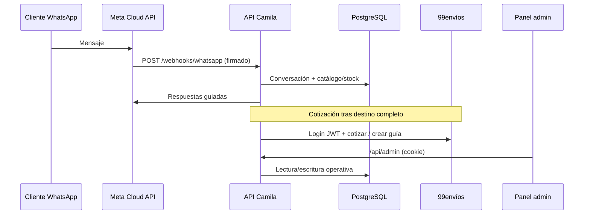

# Arquitectura

Documento de explicación. Describe cómo está armado el monorepo **Camila** según el código en `apps/` y `packages/`.

## Vista de contexto

Camila automatiza la venta conversacional por WhatsApp para un comercio con contraentrega:

1. Meta entrega eventos al webhook de WhatsApp (firma verificada).
2. La API guía la conversación, consulta catálogo/inventario y prepara el pedido.
3. Tras confirmar destino, cotiza envío vía 99envíos según políticas (global o por municipio DANE).
4. Al confirmar, reserva inventario y encola la creación de guía.
5. El panel admin opera catálogo, pedidos, conversaciones, alertas e integraciones.

## Límites del sistema

| Componente | Responsabilidad | No hace |
| --- | --- | --- |
| `@camila/api` | Dominio, webhooks, admin API, media, workers/CLI | UI |
| `@camila/admin` | UX operativa | Reglas de negocio críticas (las ejecuta la API) |
| `@camila/contracts` | Tipos/contratos compartidos | I/O |
| PostgreSQL | Estado durable | Archivos de foto (van a `MEDIA_ROOT`) |
| 99envíos | Cotización y guías | Inventario Camila |

## Módulos de la API (`apps/api/src/modules`)

| Módulo | Rol |
| --- | --- |
| `whatsapp` | Conexión Cloud API, verificación de webhook, envío de mensajes |
| `conversations` | Estado del diálogo y toma de control humana |
| `catalog` | Referencias, fotos, importación CSV |
| `inventory` | Stock por talla, reservas, movimientos, cierres |
| `orders` | Pedidos y confirmación |
| `shipping` | Políticas, cotización, guías, PDF, resultados inciertos |
| `localities` | Catálogo DANE/localidades para envío |
| `auth` | Sesión de la propietaria / admin |
| `dashboard` | Métricas operativas |
| `alerts` | Alertas operativas |
| `integrations` | Estado de integraciones externas |

Rutas HTTP principales (`apps/api/src/routes`):

- `health.ts` — `live` / `ready`
- `whatsapp.ts` — webhook
- `admin/` — API del panel

Arranque: `server.ts` + `app.ts` + `config.ts`. Persistencia: Drizzle bajo `database/` y migraciones en `drizzle/`.

## Panel (`apps/admin/src`)

Rutas de producto (desde `App.tsx`):

| Ruta | Función |
| --- | --- |
| `/` | Dashboard |
| `/catalog`, `/references/*`, `/catalog-import` | Catálogo e importación |
| `/orders`, `/orders/new`, `/orders/:id` | Pedidos |
| `/conversations` | Bandeja de conversaciones |
| `/settings/shipping`, `/settings/whatsapp`, `/settings/integrations` | Preferencias |
| `/alerts` | Alertas |
| `/inventory/closures` | Cierres de inventario |
| `/more` | Más herramientas |

Hay un sistema de diseño propio en `apps/admin/src/design` y estilos en `styles.css`.

## Flujo crítico: confirmación y guía

1. Cotización tras destino completo; se guardan alternativas por versión del borrador.
2. Selección de transportadora: regla exacta del municipio → preferencias → menor costo (según implementación de shipping).
3. Confirmación bajo bloqueo de base de datos: cotización cambiada o vencida **no** reserva.
4. Misma transacción: confirma, reserva e inserta un único trabajo de guía.
5. Worker: fallos previos al envío vs. resultados **inciertos** posteriores (sin reintento automático).
6. PDF solo para guía creada; se valida, escribe de forma atómica y se sirve autenticado (caché privada + ETag).

## Entornos

| Entorno | Base de datos | Notas |
| --- | --- | --- |
| Desarrollo | `postgres` en Compose | Volumen persistente |
| Integración / E2E | `postgres-test` (profile `test`) | tmpfs; datos efímeros |
| Producción | Aprovisionada por el operador | HTTPS, backups y rotación de secretos obligatorios |

## Decisiones de diseño relevantes

- **Talla primero:** evita mostrar stock de otras tallas y reduce fricción conversacional.
- **Referencias nuevas inactivas tras CSV:** fuerza foto y revisión antes de publicar.
- **Adaptadores configurables:** WhatsApp y 99envíos se pueden desactivar por configuración (`shipping_not_configured`).
- **Idempotencia en localidades:** SHA-256 de la fuente evita reescrituras inútiles.

Para el plan de producto, ver [ROADMAP.md](../ROADMAP.md).
