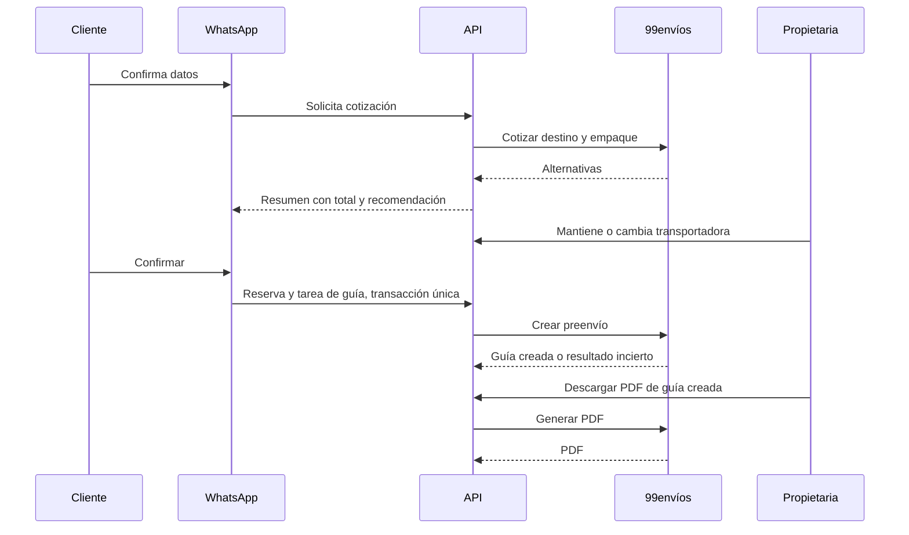

# Diseño de cotización y operación de guías

## Objetivo

Completar el flujo de venta contraentrega con una cotización verificable, elección controlada de transportadora, creación única de guía, recuperación segura del PDF y visibilidad para la propietaria.

## Alcance

Este diseño extiende los pedidos existentes, el flujo guiado de WhatsApp y el panel protegido. No cambia el catálogo, no conecta Treinta, no introduce Chatwoot ni realiza llamadas autenticadas a 99envíos hasta que la propietaria entregue sus credenciales por un canal autorizado.

## Decisiones de negocio

- Cada pedido usa un perfil inicial de empaque: `1 kg`, `30 × 20 × 12 cm`. El perfil se conserva en la cotización y podrá configurarse por referencia en una ampliación posterior.
- Se solicitan las cotizaciones disponibles de 99envíos para el destino DANE del pedido.
- La propietaria puede asignar una transportadora preferida a un municipio por su código DANE. Si esa transportadora tiene cobertura, se recomienda y selecciona aunque su tarifa sea mayor.
- Sin una regla municipal aplicable, se recomienda **Envia** si la respuesta la incluye como exitosa. Si no hay cobertura de Envia, se recomienda la alternativa con menor `valor + valor_contrapago + sobreflete`.
- La propietaria puede elegir otra alternativa disponible. Cambiar de opción invalida el resumen anterior y exige uno nuevo antes de confirmar.
- El cliente recibe el total confirmado antes de reservar. El flete y el cargo de recaudo se guardan por separado; el total es `subtotal de producto + flete + recaudo + sobreflete`.
- El pedido conserva una copia inmutable de la cotización elegida. Una cotización expira a los 30 minutos desde su creación; al expirar se debe consultar de nuevo y presentar otro resumen.
- Al confirmar se reserva stock y se inserta una única tarea de guía en la misma transacción. La repetición de la confirmación devuelve el mismo pedido y la misma tarea.
- Un timeout o una respuesta inválida después de enviar el preenvío deja la tarea en `uncertain`; no se reintenta automáticamente.
- El PDF se obtiene únicamente para una guía ya creada. Reintentar el PDF no crea un preenvío ni altera inventario.

## Datos persistidos

### `shipping_quotes`

Una fila por alternativa devuelta para una versión de cotización. Contiene `id`, `order_id`, `draft_version`, `carrier`, `service_id`, `freight_cop`, `cash_on_delivery_cop`, `surcharge_cop`, `estimated_days`, `quoted_at`, `expires_at`, `recommended` y `selected`.

Restricciones: valores COP enteros no negativos; una sola alternativa seleccionada por pedido; una sola recomendada por conjunto de cotización; `expires_at > quoted_at`; el pedido debe existir. Las consultas anteriores no se modifican.

### `shipping_guide_jobs`

Se amplía con `quote_id`, `guide_pdf_fetched_at`, `guide_pdf_sha256`, `guide_pdf_byte_size` y `guide_pdf_storage_key`. La guía almacena el número de preenvío, la transportadora y el flete ya existentes. El PDF se guarda en una ruta generada por servidor fuera de las fotos y solo se sirve por una ruta autenticada del panel.

Estados permitidos: `pending`, `processing`, `created`, `failed`, `uncertain`. El PDF es un atributo independiente: su ausencia no cambia una guía creada.

### `shipping_carrier_rules`

Una regla activa por código DANE de ocho dígitos. Contiene `locality_carrier_code`, `carrier`, `active`, `created_at` y `updated_at`. La regla no inventa cobertura: solo decide entre las alternativas exitosas que devolvió 99envíos.

## Adaptador de 99envíos

El adaptador conserva las credenciales exclusivamente en el servidor y autentica cada operación con `POST /api/integration/v1/login`.

- `POST /cotizar`: destino con código DANE, tipo y servicio de entrega `1`, perfil de empaque, valor declarado, fecha y `AplicaContrapago: true`.
- `POST /preenvio`: usa la alternativa seleccionada y el destinatario confirmado. El código DANE debe tener exactamente ocho dígitos.
- `POST /pdf/2`: usa el número de guía/preenvío y transportadora de una tarea creada. La respuesta debe ser PDF no vacío.
- Una respuesta `429` en cotización se convierte en un error recuperable con espera indicada por 99envíos; no se realizan reintentos automáticos.
- Errores `4xx` de cotización o creación son deterministas y se muestran como rechazo. Un error de red antes de conocer el resultado de creación es incierto.

## Flujo

## Superficie HTTP y panel

Todas las rutas requieren sesión de propietaria y `Origin` exacto en mutaciones.

- `POST /api/admin/orders/:orderId/shipping-quotes`: obtiene y persiste alternativas para el borrador completo.
- `POST /api/admin/orders/:orderId/shipping-quotes/:quoteId/select`: selecciona una alternativa vigente y devuelve un resumen nuevo.
- `GET /api/admin/orders/:orderId/shipping`: devuelve cotización vigente, historial de alternativas y tarea de guía.
- `POST /api/admin/orders/:orderId/shipping-guide/pdf`: descarga y guarda el PDF de una guía creada; es idempotente cuando ya existe un archivo íntegro.
- `GET /api/admin/orders/:orderId/shipping-guide/pdf`: transmite el PDF almacenado con autorización, sin exponer la ruta física.
- `POST /api/admin/orders/:orderId/shipping-guide/review`: permite a la propietaria anotar el resultado comprobado de una tarea incierta; no crea una guía nueva.

El detalle del pedido muestra: cotización, recomendación, opción seleccionada, componentes del total, vencimiento, número de guía, estado, error resumido y acciones válidas. Nunca muestra credenciales, payloads de 99envíos ni rutas de archivo.

## WhatsApp

Tras los datos válidos, el bot solicita cotización y manda un resumen con la alternativa recomendada. Si la propietaria elige otra alternativa desde el panel antes de la confirmación, el bot presenta el total nuevo y requiere otra confirmación. Si no hay cobertura o la cotización expira, el bot informa que una asesora revisará el envío y no reserva mercancía.

## Pruebas y aceptación

- Contratos estrictos para tarifas, estados, vencimiento y respuestas HTTP.
- Pruebas de integración para una única alternativa seleccionada, expiración, cambio de transportadora, resumen obsoleto y tarea única por pedido.
- Pruebas unitarias con dobles para `429`, respuesta parcial, respuesta inválida, timeout de preenvío y PDF vacío/no-PDF.
- Pruebas HTTP para autenticación, CSRF, no exposición de información sensible y transmisión de PDF.
- Pruebas de interfaz para alternativa recomendada, selección, vencimiento, estados y descarga.
- E2E: pedido → cotización → selección → confirmación → guía creada → PDF; y pedido → resultado incierto → revisión humana sin reintento.
- Prueba controlada final con cuenta autorizada: una cotización, un preenvío y un PDF, verificando destinatario, recaudo, transportadora y número de guía.

## Dependencias operativas

Antes de activar el flujo real se requieren: credenciales autorizadas de 99envíos, CSV vigente de localidades colombianas con códigos DANE de ocho dígitos, dirección de origen configurada en la sucursal de 99envíos y revisión de que el perfil inicial de empaque coincide con el producto real.

## Fuentes

- [API oficial de 99envíos](https://integration.99envios.app/api-docs)
- [Catálogo de localidades compartido](https://docs.google.com/document/d/1RQxkGWIiQsoHtBUP8SDhINw3f_IHMRMT_NM2r6JkTxo/edit?usp=sharing)
