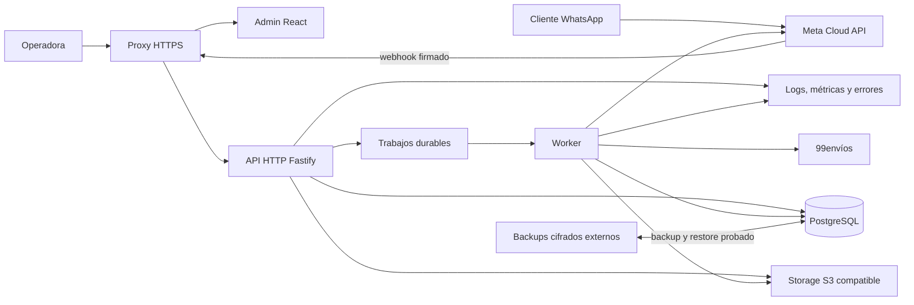

# KAIRO: diseño rector de estabilización y preparación para producción

Fecha: 21 de septiembre de 2026

Estado: aprobado en conversación; pendiente de revisión del documento por la usuaria

Producto: KAIRO Operaciones
Alcance: un negocio colombiano de calzado, un número de WhatsApp y operación contraentrega

## 1. Propósito

Este documento define cómo llevar el sistema KAIRO actual a un producto profesional, estable y funcional de extremo a extremo. No propone reescribir la aplicación. Ordena la corrección del producto existente, consolida sus decisiones técnicas y funcionales, y establece las condiciones verificables para operarlo en producción.

“Funcional al 100 %” significa que todos los flujos incluidos en este documento funcionan con datos y cuentas reales, tienen estados de error y recuperación, están cubiertos por pruebas proporcionales a su riesgo y pueden operarse sin depender de conocimiento informal del código. No significa que los proveedores externos nunca fallen; significa que KAIRO detecta, registra y permite recuperar esos fallos sin duplicar cobros, inventario, mensajes ni guías.

El trabajo se dividirá en diez fases con puertas de salida obligatorias. Cada fase será un subproyecto verificable y tendrá posteriormente su propio plan detallado para Cursor.

## 2. Decisiones rectoras

### 2.1 Alcance aprobado

- El producto visible se llamará **KAIRO Operaciones**.
- El alcance actual es exclusivamente KAIRO; no se construirá una plataforma SaaS multiempresa.
- Se conservará el monorepo TypeScript con React, Fastify, Drizzle y PostgreSQL.
- WhatsApp Cloud API y 99envíos serán integraciones reales de producción.
- Treinta seguirá siendo una integración manual y controlada mediante importación y cierre; no se prometerá una API inexistente.
- Se fortalecerá la bandeja humana nativa de KAIRO. No se añadirá Chatwoot.
- PostgreSQL continuará como fuente de verdad y cola durable. No se añadirá Redis mientras no exista una necesidad demostrada.
- No se implementará modo oscuro en este programa.
- La administración seguirá siendo responsive web; no se construirá una aplicación móvil nativa.
- Las decisiones legales sobre conservación y eliminación de datos serán una puerta humana antes de activar borrados automáticos.

### 2.2 Enfoques considerados

Se consideraron tres formas de completar el producto:

1. **Reescritura completa.** Daría libertad arquitectónica, pero elevaría el riesgo, repetiría funcionalidad ya probada y retrasaría la validación real.
2. **Correcciones puntuales sin reestructuración.** Sería rápida al principio, pero mantendría archivos críticos sobredimensionados, workers acoplados al servidor y deuda visual que seguiría generando regresiones.
3. **Estabilización incremental con límites de dominio.** Corrige primero la línea base, conserva lo que funciona y modulariza por etapas con pruebas de caracterización y migraciones compatibles.

Se adopta la tercera opción. Es la única que combina continuidad operativa, reducción de riesgo y una arquitectura mantenible sin convertir el proyecto en una reescritura.

## 3. Estado auditado del repositorio

La auditoría corresponde al estado observado el 21 de septiembre de 2026.

### 3.1 Base técnica existente

- Monorepo pnpm con `apps/api`, `apps/admin` y `packages/contracts`.
- API Fastify 5, Drizzle y PostgreSQL.
- Panel React/Vite con sesión administrativa mediante cookie HttpOnly.
- Contratos TypeScript compartidos.
- Webhook firmado de WhatsApp, adaptador de 99envíos, catálogo, inventario, pedidos, conversaciones, localidades, alertas, integraciones y dashboard.
- CI en GitHub Actions con `pnpm verify` y auditoría de dependencias de producción.
- Helmet, CORS por origen, limitación de login, redacción de secretos en logs, cifrado de credenciales y verificación de firma de Meta ya presentes.

### 3.2 Evidencia de calidad actual

| Comprobación | Resultado auditado | Interpretación |
| --- | --- | --- |
| Formato | Falla en 46 archivos | La rama principal no cumple su propia puerta de formato |
| ESLint | 4 errores y 4 advertencias | Existen efectos React problemáticos y una asignación inútil en API |
| TypeScript | Pasa después de instalar el lockfile limpio | El fallo inicial era del entorno local, no del código versionado |
| Unitarias de contracts | 68 aprobadas | Base de contratos saludable |
| Unitarias de API | 194 aprobadas | Cobertura funcional valiosa, todavía sin umbrales explícitos |
| Unitarias de admin | 49 de 50 en suite completa | Una prueba de búsqueda expira bajo carga, aunque pasa aislada |
| Integración API | 102 aprobadas y 4 fallidas | Hay un defecto real de normalización y dos conjuntos de expectativas obsoletas |
| E2E | 6 aprobadas, 4 fallidas y 12 sin ejecutar | Los fallos tempranos impiden confiar en el recorrido completo |
| Build | Aprobado | El producto compila para producción |
| Auditoría de producción | Sin vulnerabilidades conocidas | Es un buen punto de partida, no sustituye hardening ni escaneo de secretos |

### 3.3 Defectos confirmados de mayor prioridad

- La regla global no estratificada `a { color: var(--foreground); }` en `apps/admin/src/styles.css` anula colores de utilidades y deja texto negro sobre fondo negro en navegación activa y llamadas a la acción.
- El texto secundario del login tiene una relación aproximada de contraste de 4.34:1, inferior al mínimo AA de 4.5:1 para texto normal.
- El importador de catálogo compara tallas como cadenas crudas; PostgreSQL puede devolver `37.0` donde la importación trae `37`, provocando un intento de inserción duplicada.
- Una prueba de repositorio de trabajos de guía crea pedidos `draft` aunque espera que sean reclamables como `confirmed`.
- Una prueba HTTP antigua espera rechazar una referencia existente, mientras la regla vigente permite conciliarla.
- Las pruebas E2E conservan nombres y textos anteriores: KAIRO/Camila, “Probar borrador”/“Simular” y “Cierres de Treinta”/“Cierres diarios”.
- El editor del bot apila navegación, edición, vista previa y comandos en una sola columna extensa; es ineficiente en escritorio y especialmente débil en móvil.
- Envíos e Integraciones presentan páginas demasiado largas, repetición de bloques y textos genéricos que no corresponden a cada proveedor.
- La búsqueda global descarga páginas desde el cliente en lugar de usar una consulta de búsqueda del servidor.

### 3.4 Deuda estructural confirmada

- `apps/admin/src/styles.css` supera las 2.400 líneas y convive con tokens y estilos globales de distintas generaciones.
- `apps/api/src/routes/admin/index.ts` concentra alrededor de 77 registros de rutas y más de 1.300 líneas.
- `apps/api/src/database/schema.ts` reúne 37 tablas en más de 1.100 líneas.
- `packages/contracts/src/index.ts` supera las 900 líneas.
- Páginas como Envíos, Flujo del bot, Integraciones y Detalle de pedido mezclan demasiadas responsabilidades.
- Repositorios de pedidos y catálogo y el servicio de venta por WhatsApp son puntos de alta complejidad.
- Los workers por intervalos se inician dentro del proceso HTTP, dificultando escalado, apagado y pruebas aisladas.
- El `compose.yaml` actual cubre PostgreSQL local y de pruebas, pero no define la topología productiva.
- No hay contenedores de aplicación endurecidos, proxy HTTPS, backup externo automatizado, restauración probada ni alertas independientes.
- La documentación histórica conserva decisiones superadas, como Chatwoot, que pueden inducir implementaciones contradictorias.

## 4. Objetivos y no objetivos

### 4.1 Objetivos

1. Recuperar una línea base reproducible con CI completamente verde.
2. Corregir defectos visuales, funcionales y de accesibilidad que impiden operar con confianza.
3. Consolidar una experiencia operativa clara en escritorio y móvil.
4. Separar responsabilidades sin romper los contratos públicos existentes.
5. Completar y endurecer todos los recorridos de negocio incluidos.
6. Proteger credenciales, sesiones, datos personales y acciones administrativas.
7. Desplegar mediante una topología productiva recuperable y observable.
8. Validar WhatsApp y 99envíos con cuentas reales y acciones deliberadas.
9. Cargar datos reales de manera controlada y ejecutar un piloto operativo.
10. Lanzar con criterios de aceptación, documentación y periodo de estabilización.

### 4.2 Fuera de alcance

- Multiempresa, suscripciones, facturación SaaS o autoservicio de tenants.
- IA generativa para decidir el flujo de venta.
- Automatización por clics o scraping de Treinta.
- Chatwoot, Redis, Kubernetes o microservicios independientes.
- Campañas masivas, otros canales de mensajería o aplicación móvil nativa.
- Contabilidad, conciliación financiera completa o promesas logísticas no publicadas por 99envíos.
- Recuperar secretos completos desde la API después de almacenarlos.
- Ejecutar JavaScript, SQL, expresiones libres o URLs arbitrarias configuradas por la operadora.

## 5. Arquitectura objetivo



### 5.1 Monorepo y límites

Se conserva la organización general, pero cada aplicación se divide internamente por dominio:

- `apps/admin`: shell de aplicación, componentes compartidos mínimos y features por dominio.
- `apps/api`: bootstrap, adaptadores, dominios, rutas/controladores y dos entrypoints operativos.
- `packages/contracts`: contratos agrupados por dominio con un export público estable.

Los nombres internos `@camila/*` pueden conservarse para evitar una migración de paquetes sin valor funcional. Toda superficie visible para la operadora y toda documentación vigente usarán KAIRO Operaciones.

### 5.2 API y workers

La API HTTP y los workers usarán el mismo código y la misma imagen, pero entrypoints distintos:

- El proceso HTTP validará solicitudes, ejecutará operaciones síncronas cortas y publicará trabajos durables.
- El proceso worker reclamará trabajos transaccionalmente, renovará leases cuando aplique y registrará cada intento.
- Ningún worker se iniciará implícitamente al importar o levantar la API.
- El apagado será ordenado: dejar de reclamar, terminar operaciones seguras y liberar recursos.
- Escalar HTTP no multiplicará accidentalmente schedulers ni consumidores.

### 5.3 Persistencia

PostgreSQL seguirá siendo la fuente de verdad para negocio, auditoría y trabajos durables. El esquema se separará por archivos de dominio sin reescribir el historial de migraciones. Las nuevas migraciones serán hacia adelante, idempotentes cuando corresponda y compatibles con la ventana de rollback de la aplicación.

La abstracción de archivos tendrá al menos dos implementaciones:

- almacenamiento local para desarrollo y pruebas;
- almacenamiento S3 compatible para producción.

PostgreSQL conservará metadatos, huellas, propietario lógico y estado de cada archivo, no rutas locales asumidas por el dominio.

### 5.4 Topología productiva

La entrega productiva mediante Docker Compose incluirá:

- proxy con HTTPS y renovación de certificados;
- panel estático;
- API HTTP;
- worker;
- PostgreSQL con volumen persistente;
- tarea explícita de migración;
- backup cifrado con copia fuera del servidor;
- health checks y observabilidad externa.

Los contenedores ejecutarán usuarios no root, tendrán filesystem de solo lectura cuando sea viable, límites de recursos, secretos fuera de la imagen y redes con exposición mínima.

## 6. Diseño de experiencia administrativa

### 6.1 Sistema visual

- Un único sistema de tokens para color, tipografía, espaciado, elevación, radios y estados.
- Eliminación gradual de reglas globales heredadas; los estilos globales solo podrán contener reset, tokens y fundamentos documentados.
- Componentes compartidos para formularios, botones, enlaces, estados, tablas responsive, diálogos, badges y mensajes.
- Copia consistente en español para fechas, dinero, estados, errores y acciones.
- Sin selector ni código incompleto de modo oscuro.

La meta de accesibilidad será WCAG 2.2 nivel AA, incluyendo teclado completo, foco visible, objetivos táctiles de al menos 44 px, orden de lectura lógico, nombres accesibles, anuncios de estado y respeto por movimiento reducido.

Los viewports mínimos de aceptación serán 390, 768, 1280 y 1440 px.

### 6.2 Navegación y dashboard

La navegación separará:

- operación diaria;
- pedidos y conversaciones;
- catálogo e inventario;
- envíos y cierres;
- configuración y administración.

En móvil, “Más” contendrá todas las operaciones secundarias sin ocultarlas. El dashboard priorizará colas accionables: conversaciones pendientes, pedidos que requieren intervención, guías inciertas, inventario bajo, importaciones con conflictos y cierres pendientes. Las métricas descriptivas serán secundarias.

### 6.3 Estados de interacción

Cada vista y acción tendrá estados explícitos de:

- carga;
- vacío;
- éxito persistente;
- error recuperable;
- permiso insuficiente;
- confirmación de acción sensible;
- reintento seguro;
- dependencia externa degradada.

Una acción importante no terminará únicamente con un toast. Mostrará el resultado, su efecto operativo y el siguiente paso disponible.

### 6.4 Flujos prioritarios

**Flujo del bot**

- Escritorio: navegación compacta de pasos, editor principal y panel de vista previa/acciones persistente.
- Móvil: vistas sucesivas para pasos, edición y simulación con una barra fija de guardar/probar.
- La simulación nunca enviará mensajes, reservará inventario ni creará guías.

**Integraciones**

- Asistente por proveedor: ingresar credenciales, probar conexión, activar versión y verificar operación.
- Los textos, validaciones y comprobaciones serán propios de Meta, 99envíos, almacenamiento y scheduler.
- Una prueba fallida nunca reemplazará credenciales activas.

**Envíos**

- La interfaz se dividirá en política general, excepciones por localidad, simulador de decisión e incidentes.
- La operadora podrá comprender por qué se seleccionó una transportadora sin exponer detalles técnicos innecesarios.

**Bandeja humana**

- Filtros, no leídos, búsqueda, asignación/toma de control, transcript, estado de envío y contexto del pedido.
- Los fallos de mensajes conservarán contenido, causa pública, intentos y recuperación segura.

**Pedidos**

- Línea de tiempo única con confirmación, reserva, guía, PDF, mensajes, incidentes, despacho, entrega, devolución y cancelación permitida.
- Las acciones disponibles dependerán del estado real y explicarán por qué otras están bloqueadas.

**Catálogo e inventario**

- Indicadores de preparación para publicación.
- Importación con vista previa y conciliación.
- Historial de movimientos, stock físico, reservado y disponible.
- Normalización canónica de referencia y talla antes de comparar o persistir.

**Búsqueda global**

- Endpoint del servidor con consulta, permisos, paginación y límites.
- El cliente no descargará lotes de páginas para filtrar localmente.

## 7. Modelo funcional y reglas de dominio

### 7.1 Estados explícitos

Pedidos, conversaciones, reservas, guías, mensajes, importaciones, configuraciones y trabajos tendrán máquinas de estado declaradas. Cada transición definirá:

- estado de origen y destino;
- actor o evento permitido;
- precondiciones;
- cambios transaccionales;
- evento de auditoría;
- respuesta ante repetición.

No se actualizarán estados críticos mediante asignaciones libres desde controladores.

### 7.2 Representaciones canónicas

- Talla: decimal canónico que trate `37` y `37.0` como el mismo valor.
- Dinero: enteros en centavos o unidad monetaria indivisible definida; nunca `float` binario.
- Teléfono: representación E.164 y presentación separada.
- Código DANE: cadena de ocho dígitos que preserve ceros iniciales.
- Referencia comercial: forma normalizada para comparación y valor original para presentación cuando sea necesario.
- Fechas operativas: instantes UTC con zona `America/Bogota` aplicada en políticas y presentación.

La normalización ocurrirá en los límites de entrada y será reutilizada por contratos, dominio, repositorios e importadores.

### 7.3 Idempotencia y concurrencia

Requerirán clave idempotente o deduplicación equivalente:

- webhooks y mensajes entrantes;
- confirmación del pedido;
- creación y liberación de reserva;
- solicitud de guía;
- almacenamiento y envío del PDF;
- mensajes salientes;
- cierres de inventario;
- importaciones publicadas.

La base de datos protegerá invariantes con restricciones, índices únicos, bloqueos o actualizaciones condicionales. Las comprobaciones exclusivas en memoria no serán suficientes.

### 7.4 Flujo crítico de venta

```text
webhook firmado
  → deduplicar evento
  → cargar conversación y versión del flujo
  → validar talla y consultar stock publicable
  → recopilar y validar datos
  → cotizar y congelar snapshot
  → confirmar de forma idempotente
  → reservar stock en transacción
  → publicar trabajo de guía
  → crear guía una sola vez
  → guardar PDF y enviar documento
  → registrar trazabilidad y alertas
```

Si la respuesta de 99envíos es incierta después de enviar un preenvío, el trabajo quedará bloqueado para conciliación humana. No se reintentará automáticamente una operación que pudiera haber creado la guía.

### 7.5 Treinta

Treinta se mantendrá como proceso manual controlado:

- importación inicial o conciliación con vista previa;
- conflictos visibles antes de aplicar;
- cierre diario con snapshot, responsable y diferencias;
- reejecución segura sin duplicar movimientos;
- documentación operativa de qué se actualiza en cada sistema.

## 8. Seguridad, privacidad y auditoría

### 8.1 Identidad y sesión

- Contraseñas robustas con algoritmo y parámetros revisables.
- MFA TOTP para cuentas administrativas y códigos de recuperación de un solo uso.
- Rotación de sesión después de autenticación y acciones sensibles.
- Revocación individual y global de sesiones.
- Expiración absoluta e inactividad configurables.
- Purga programada de sesiones vencidas.
- Protección contra fuerza bruta con límites, retrasos y eventos auditables.

### 8.2 Fronteras HTTP

- Cookies `HttpOnly`, `Secure` en producción y `SameSite` definido.
- CORS y validación de `Origin` por lista exacta.
- Límites de cuerpo y archivos por endpoint.
- Validación estricta de tipo, firma y contenido antes de persistir.
- Contrato público de errores sin stack traces, SQL, secretos ni datos personales innecesarios.
- Correlation ID desde el borde hasta trabajos, logs y llamadas externas.

### 8.3 Secretos

- Credenciales cifradas en reposo con cifrado autenticado, versión de clave e IV único.
- Claves maestras fuera de PostgreSQL y de las imágenes.
- Procedimiento probado de rotación de claves.
- Respuestas administrativas que solo indiquen estado, huella segura o últimos caracteres permitidos.
- Redacción de tokens, cookies, firmas, contraseñas, documentos, teléfonos y direcciones en logs.
- Escaneo de secretos y dependencias en CI.

### 8.4 Autorización y auditoría

Aunque el lanzamiento pueda iniciar con una propietaria, los permisos se expresarán como capacidades y no como comprobaciones dispersas de nombre de usuario. Como mínimo se distinguirán operación, configuración sensible y administración de acceso.

Se auditarán de forma append-only:

- inicio de sesión, MFA y revocaciones;
- cambios de permisos;
- activación o rotación de integraciones;
- publicación de flujos, localidades y políticas;
- ajustes de inventario y cierres;
- transiciones manuales de pedidos y guías;
- exportaciones, anonimización y eliminación de datos.

### 8.5 Privacidad y retención

Antes de producción se elaborará un inventario de datos personales, finalidad, ubicación, acceso y plazo aplicable. La configuración contemplará expiración de borradores, conversaciones, sesiones, archivos y registros técnicos.

No se activará eliminación automática de datos comerciales o personales hasta que una persona responsable apruebe la matriz de retención conforme a las obligaciones aplicables en Colombia. Hasta esa aprobación, el sistema podrá identificar candidatos y simular el resultado sin borrar. Después, los jobs de retención serán auditables, reanudables y distinguirán eliminación, anonimización y conservación obligatoria.

Las solicitudes de exportación o eliminación exigirán autenticación reforzada, vista previa, confirmación explícita y registro de evidencia.

## 9. Errores, confiabilidad y observabilidad

### 9.1 Taxonomía de errores

- **Validación:** la usuaria puede corregir datos concretos.
- **Conflicto:** el estado cambió; se recarga o compara antes de repetir.
- **Temporal interno:** se puede reintentar con límites.
- **Proveedor degradado:** se conserva el trabajo y se informa sin prometer éxito.
- **Resultado externo incierto:** se bloquea la repetición y se concilia manualmente.
- **Fallo permanente:** requiere corrección de configuración, datos o intervención.

La interfaz mostrará mensajes operativos y próximos pasos; los logs conservarán el diagnóstico técnico correlacionado.

### 9.2 Trabajos durables

- Reclamación transaccional con propietario y vencimiento.
- Intentos, siguiente ejecución y último error estructurado.
- Backoff acotado con jitter para operaciones seguras.
- Dead-letter o estado equivalente para fallos agotados.
- Reanudación manual protegida y auditada.
- Idempotencia independiente del número de intentos.
- Métricas de profundidad, edad del trabajo más antiguo, éxito, fallo y duración.

### 9.3 Salud y telemetría

- Liveness sin depender de servicios externos.
- Readiness que compruebe dependencias necesarias para aceptar tráfico.
- Estado operativo separado para integraciones, workers y schedulers.
- Logs estructurados con correlation ID y redacción.
- Métricas de HTTP, base de datos, trabajos, mensajes, reservas, guías y proveedores.
- Seguimiento de errores con versiones desplegadas y contexto sanitizado.
- Alertas externas al mismo servidor para caída, saturación, backups, errores repetidos, jobs atascados y certificados.

### 9.4 Backups y recuperación

- Backups automáticos cifrados fuera del VPS.
- Política de retención definida y capacidad de detectar copias fallidas.
- Backup verificado antes de una migración de riesgo.
- Restauración periódica en un entorno aislado.
- Registro del RPO y RTO alcanzados en cada simulacro.
- Runbooks para PostgreSQL, almacenamiento, proxy, Meta, 99envíos y worker.

Los valores finales de RPO, RTO y retención serán aprobados en la fase de infraestructura según el costo y el riesgo operativo; no se asumirán silenciosamente.

## 10. Estrategia de calidad

### 10.1 Capas de prueba

- Unitarias para reglas de negocio, normalización, máquinas de estado y adaptadores puros.
- Contratos para entradas, salidas y errores públicos.
- Integración con PostgreSQL aislado y reiniciable.
- Componentes para interacciones administrativas críticas.
- E2E para autenticación, catálogo, inventario, pedido, conversación, guía, despacho, entrega, devolución y cierre.
- Accesibilidad automática y recorrido manual con teclado.
- Pruebas de concurrencia, duplicación, retries y respuestas inciertas.
- Pruebas de migración desde base vacía y desde una copia representativa anonimizada.
- Pruebas de carga de login, bandeja, pedidos, inventario y webhooks.

Las pruebas de integración no levantarán workers no controlados contra su misma base. Cada suite será determinista y limpiará o aislará sus datos.

### 10.2 Cobertura

- Reglas críticas de pedidos, inventario, mensajes y guías: al menos 90 % de líneas y ramas, más escenarios explícitos de invariantes.
- Módulos modificados no críticos: al menos 80 % de líneas y ramas.
- La cobertura global no permitirá compensar un dominio crítico sin pruebas mediante archivos triviales.
- Un porcentaje no sustituirá pruebas de concurrencia, contrato o E2E.

### 10.3 Puerta de CI

Todo cambio destinado a integración ejecutará, según la fase:

1. instalación con lockfile congelado;
2. formato;
3. lint sin errores;
4. tipos;
5. unitarias y contratos;
6. integración;
7. build de producción;
8. E2E críticos;
9. accesibilidad;
10. auditoría de dependencias y secretos;
11. análisis de imágenes Docker;
12. smoke test del artefacto desplegable.

No se ocultarán fallos con exclusiones generales, aumentos indiscriminados de timeout o reintentos que enmascaren inestabilidad.

### 10.4 Rendimiento

- Presupuestos de bundle por entrada y carga diferida de módulos pesados.
- Búsqueda y listados paginados en el servidor.
- Revisión con `EXPLAIN` e índices para consultas importantes.
- Medición p50/p95/p99 de API y duración de jobs.
- Detección de renders, consultas y solicitudes duplicadas.

La fase de calidad establecerá una línea base reproducible en hardware y datos documentados. Los límites de regresión se fijarán sobre esa base antes del piloto, en vez de inventar cifras sin contexto.

## 11. Entornos, despliegue y liberación

### 11.1 Entornos

- **Local:** proveedores simulados y datos no sensibles.
- **Test:** ejecución determinista con datos desechables.
- **Staging:** topología equivalente a producción, credenciales de prueba y datos sintéticos o anonimizados.
- **Producción:** datos y cuentas reales, acceso restringido y alertas activas.

La configuración se validará al arranque. En producción, una variable crítica ausente o una opción insegura impedirá iniciar el servicio.

### 11.2 Despliegue

- Imágenes inmutables, etiquetadas por versión y digest.
- Migraciones como tarea independiente y observable.
- Despliegue con health checks y smoke tests.
- Copia previa en cambios de datos de riesgo.
- Rollback de aplicación sin revertir destructivamente la base.
- Compatibilidad de esquema durante la ventana de rollback.
- Registro de versión del panel, API, worker y migración aplicada.

### 11.3 Validación real

La activación externa seguirá cuatro pasos separados:

```text
credenciales → prueba no destructiva → activación → verificación operativa deliberada
```

Para Meta se verificará webhook, firma, recepción, envío, plantillas, ventana de atención y coexistencia solo si Meta la confirma para la cuenta. Para 99envíos se verificará login, cotización, preenvío deliberado, PDF y novedades disponibles. Crear una guía real requerirá pedido de prueba autorizado y confirmación humana.

### 11.4 Piloto y lanzamiento

- Importación controlada de catálogo, stock, localidades y configuración.
- Ensayo completo en staging.
- Piloto con pocas personas y pedidos deliberados.
- Clasificación de hallazgos por severidad.
- Cero defectos P0 o P1 abiertos para el go-live.
- Checklist de go/no-go aprobada.
- Periodo de estabilización con seguimiento reforzado, revisión diaria y rollback preparado.

## 12. Programa de diez fases

### Fase 1. Recuperar la línea base

Corregir formato, lint, pruebas obsoletas, normalización de talla, E2E rotos, contraste crítico y flakiness. Documentar qué fallos eran defectos y cuáles eran expectativas antiguas.

**Puerta de salida:** `pnpm verify`, build y auditoría pasan desde una instalación limpia; no hay servidores o workers externos contaminando las pruebas.

### Fase 2. Consolidar diseño, responsive y accesibilidad

Unificar marca, tokens y componentes; retirar la cascada heredada peligrosa; completar estados de interfaz; ajustar navegación y responsive; cumplir WCAG 2.2 AA en recorridos principales.

**Puerta de salida:** cero violaciones Axe críticas o serias en flujos incluidos, teclado funcional y aceptación visual en cuatro viewports.

### Fase 3. Mejorar arquitectura frontend y UX operativa

Dividir features y páginas extensas; rediseñar Bot, Integraciones, Envíos, Bandeja, Pedidos, Catálogo e Inventario; mover búsqueda global al servidor.

**Puerta de salida:** los recorridos operativos tienen estados completos, componentes aislados y E2E de sus caminos felices y recuperables.

### Fase 4. Modularizar backend, esquema y contratos

Separar rutas/controladores y dominios, dividir contratos y schema por archivos, crear entrypoints HTTP/worker y formalizar máquinas de estado e idempotencia.

**Puerta de salida:** contratos públicos compatibles o migrados explícitamente, API y worker arrancan de forma independiente y las invariantes críticas están protegidas por base y pruebas.

### Fase 5. Completar y endurecer negocio

Cerrar huecos de pedidos, inventario, conversaciones, mensajes, guías, PDF, novedades, devoluciones, cancelaciones y cierres de Treinta. Añadir recuperación para fallos reales.

**Puerta de salida:** matriz funcional completa aprobada con unitarias, integración y E2E; ninguna acción crítica duplica efectos al repetirse.

### Fase 6. Seguridad, privacidad y auditoría

Incorporar MFA, revocación y purga de sesiones, capacidades, auditoría ampliada, rotación de secretos, inventario de datos y herramientas de retención.

**Puerta de salida:** revisión de seguridad sin hallazgos críticos, pruebas de autorización y secretos, y matriz de retención preparada para aprobación humana.

### Fase 7. Infraestructura, despliegue y recuperación

Crear imágenes endurecidas, Compose de producción, HTTPS, storage productivo, migraciones, backups externos, restore, observabilidad, alertas y runbooks.

**Puerta de salida:** despliegue reproducible en staging, restauración demostrada, alertas recibidas fuera del servidor y rollback ensayado.

### Fase 8. Integraciones reales

Conectar y validar Meta y 99envíos con credenciales reales sin exponerlas. Ejecutar pruebas no destructivas y luego operaciones reales deliberadas.

**Puerta de salida:** evidencia trazable de recepción/envío WhatsApp, cotización, una guía autorizada, PDF y manejo de fallo/incertidumbre.

### Fase 9. Datos reales, aceptación y piloto

Importar y conciliar datos, capacitar operadoras, ejecutar escenarios de aceptación y operar un piloto controlado.

**Puerta de salida:** conciliación aprobada, usuarios capacitados, cero P0/P1 y checklist de go/no-go firmada.

### Fase 10. Lanzamiento y cierre profesional

Desplegar producción, observar el periodo de estabilización, resolver regresiones, completar documentación y registrar la aceptación final.

**Puerta de salida:** operación estable durante el periodo acordado, backups y alertas verificados, métricas revisadas, runbooks entregados y cierre firmado.

## 13. Contrato de ejecución para Cursor

Después de aprobar esta especificación se crearán un plan maestro y diez planes de fase. Cada tarea para Cursor deberá contener:

- objetivo y contexto suficiente;
- dependencias y precondiciones;
- archivos concretos que debe inspeccionar o modificar;
- prueba que debe fallar primero cuando se corrija comportamiento;
- implementación esperada sin prescribir código innecesario;
- comandos exactos de verificación;
- criterios de aceptación observables;
- riesgos, compatibilidad y rollback;
- evidencia que debe registrar;
- commit recomendado;
- puerta de salida;
- marcador `[HUMANO]` para credenciales, decisiones legales, DNS, cuentas externas o acciones reales.

Reglas de ejecución:

1. Una tarea pequeña y verificable por commit; no mezclar refactors no relacionados.
2. No avanzar con la fase en rojo ni declarar terminado porque el código compila.
3. No cambiar expectativas de prueba sin enlazarlas a una regla de producto aprobada.
4. No aumentar timeouts o añadir retries antes de demostrar la causa de la inestabilidad.
5. No usar credenciales, datos personales o guías reales sin una puerta `[HUMANO]`.
6. Conservar compatibilidad y rollback durante migraciones.
7. Actualizar documentación y runbooks en la misma tarea que cambia la operación.
8. Registrar comandos y resultados relevantes como evidencia de cierre.

## 14. Puertas humanas obligatorias

Se requiere intervención de una persona responsable para:

- aprobar la política legal de retención, anonimización y eliminación;
- suministrar y rotar secretos fuera del repositorio;
- configurar dominio, DNS, VPS y cuentas de almacenamiento/monitoreo;
- aprobar permisos y configuración de Meta;
- confirmar capacidades reales y credenciales de 99envíos;
- autorizar mensajes o guías reales de prueba;
- aprobar datos a importar y resultados de conciliación;
- aceptar RPO, RTO, presupuesto y duración del piloto;
- firmar go/no-go y aceptación de producción.

Cursor podrá preparar, validar y documentar estos pasos, pero no inventará decisiones ni marcará una puerta humana como completada sin evidencia.

## 15. Riesgos principales y mitigaciones

| Riesgo | Mitigación de diseño |
| --- | --- |
| Alcance excesivo | Diez fases con gates, planes independientes y no objetivos explícitos |
| Regresiones por refactor | Línea base verde, caracterización, contratos estables y cambios incrementales |
| Duplicación de guía o stock | Idempotencia, restricciones de base y conciliación de resultados inciertos |
| Pruebas contaminadas por workers | Entrypoints separados, bases aisladas y lifecycle controlado |
| Pérdida de datos en migración | Migraciones hacia adelante, backup previo y restore ensayado |
| Exposición de datos o secretos | Cifrado, redacción, capacidades, MFA, auditoría y escaneo |
| Dependencia de proveedores | Adaptadores, estados degradados, métricas y recuperación manual segura |
| Documentación contradictoria | Esta especificación como fuente rectora y limpieza posterior de documentos históricos |
| Optimización prematura | Línea base medible antes de fijar presupuestos de regresión |
| Declaración falsa de “terminado” | Definición global y evidencia obligatoria por fase |

## 16. Definición global de terminado

KAIRO estará terminado para este alcance cuando se cumpla todo lo siguiente:

- Todos los flujos incluidos funcionan de extremo a extremo con estados de éxito, error y recuperación.
- CI está completamente verde desde una instalación limpia y es reproducible.
- No quedan defectos P0/P1 ni deuda crítica conocida sin una decisión explícita.
- Meta y 99envíos están validados con cuentas reales y evidencia sanitizada.
- HTTPS, backups externos, restauración, alertas y monitoreo están operativos.
- La interfaz cumple los criterios responsive y de accesibilidad definidos.
- Las invariantes de inventario, pedido, mensajes y guía resisten repetición y concurrencia.
- Los datos reales fueron conciliados y el piloto fue aceptado.
- Existen manuales de operación, soporte, recuperación, despliegue y rotación de secretos.
- Producción completó el periodo de estabilización acordado.
- Las puertas humanas aplicables tienen evidencia de aprobación.

## 17. Precedencia documental

Este documento gobierna el programa de estabilización de KAIRO. Cuando un documento histórico contradiga estas decisiones, prevalece este diseño, especialmente respecto a:

- marca visible KAIRO Operaciones;
- bandeja humana nativa en lugar de Chatwoot;
- ausencia de Redis mientras PostgreSQL sea suficiente;
- Treinta manual y controlado;
- separación de API y worker;
- ausencia de modo oscuro en este alcance;
- producción con HTTPS, backup externo, restore y observabilidad obligatorios.

Los contratos de negocio ya publicados y no contradichos por este documento continuarán vigentes. Cada plan de fase deberá identificar explícitamente qué documentación actualiza o archiva.
